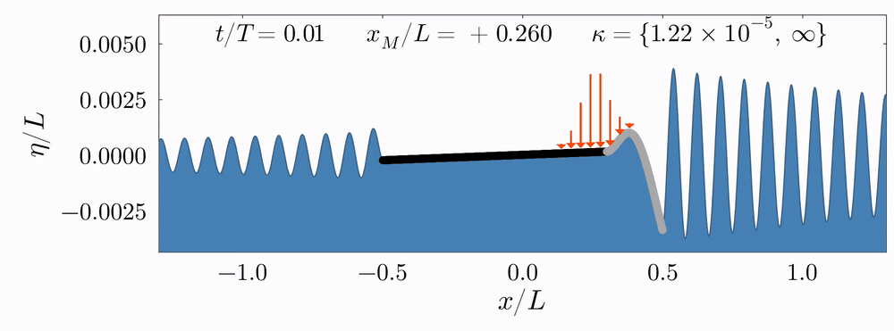

# Wave-driven propulsion of a flexible raft

This repository is the numerical companion to *"Wave-driven propulsion of a
flexible raft"*: a small vibrating raft ("Surferbot") propelled by the waves
it radiates. It contains the free-surface solver, the parameter sweeps, and
the scripts that generate every figure in the paper.



*Output of `flexible_solver` for a 10 cm raft driven at 10 Hz. The raft is
two materials joined at its midpoint (black: 10x stiffer half, pale yellow:
compliant half), producing a visibly asymmetric wake and a mean drift speed
U ≈ 2.7 mm/s.*

The active code lives in `Julia/`.

| Path | Contents |
|---|---|
| `Julia/` | The solver, sweeps, and figure scripts. |
| `docs/surferbot_paper_draft.tex` | Symlink to the paper's `main.tex`, the physics ground truth for `Julia/`. |
| `MATLAB/old_code` | The original MATLAB implementation, following Benham, Devauchelle & Thomson (2024, *JFM* 987, A44), *"On wave-driven propulsion."* `Julia/` targets numerical parity with it. |
| `python/` | An earlier JAX-based prototype (DtN operators, rigid-raft solver), superseded by `Julia/`. |

## Setup

Requires Julia 1.10+. Two environments: the package itself, and a separate
one for the `CairoMakie`-based plotting scripts (kept apart so the test
suite doesn't pay for Makie's precompile time).

```bash
cd Julia && julia --project=. -e 'using Pkg; Pkg.instantiate()'
cd scripts && julia --project=. -e 'using Pkg; Pkg.instantiate()'
```

## Running a simulation

```julia
using Surferbot

L_raft = 0.1
base = FlexibleParams(L_raft = L_raft, motor_position = -0.3L_raft, EI = 3e-5, omega = 2π * 10, rho_raft = 0.05, n = 41)
nb   = Surferbot.derive_params(base).nb_contact
EI   = vcat(fill(3e-5, nb ÷ 2), fill(3e-4, nb - nb ÷ 2))   # two materials, joined at the midpoint

params = FlexibleParams(L_raft = L_raft, motor_position = -0.3L_raft, EI = EI, omega = 2π * 10, rho_raft = 0.05, n = 41)
result = flexible_solver(params)   # -> FlexibleResult: U, thrust, eta, phi, ...

render_surferbot_run(result; outdir = "output", basename = "run", duration_periods = 2)
```

`FlexibleParams` holds the physical inputs: raft length, motor position,
flexural rigidity (scalar or, as above, a per-node vector for a graded or
multi-material beam), forcing frequency, surface tension, domain size, grid
resolution. See its docstring in `Julia/src/Surferbot.jl` for the full list.
`flexible_solver` assembles and solves the coupled beam/free-surface system
and returns a `FlexibleResult` (drift speed, thrust, surface elevation,
velocity potential). `render_surferbot_run` turns that result into an MP4
with a JSON provenance sidecar, the mechanism behind the animation above.

## Sweeps and figures

Three script prefixes, one pipeline:

- **`scripts/sweep_*.jl`** runs the solver over a parameter grid and writes
  raw results to `output/csv/` or `output/jld2/`. Some are meant for a
  cluster; see the matching `.slurm` file.
- **`scripts/postprocess_*.jl`** derives summary quantities (thrust,
  wake asymmetry, modal decomposition) from sweep output.
- **`scripts/plot_*.jl`** reads pre-computed CSV/JLD2 files and produces a
  figure; it never runs its own sweep. A figure is missing its data if the
  matching sweep/postprocess script hasn't been run yet. Each plot script's
  output shares its base name, e.g. `plot_kappa_snapshot.jl` writes to
  `output/figures/plot_kappa_snapshot_*.pdf`.

```bash
julia --project=scripts scripts/plot_kappa_snapshot.jl --paper-snapshots
```

`Julia/experiments/` holds debugging scripts with no lasting-output
guarantee.

## Tests

```bash
cd Julia && julia --project=. -e 'using Pkg; Pkg.test()'
```

CI runs the same command on every push to `main` (`.github/workflows/julia-tests.yml`).
Coverage includes the system assembly, modal decomposition, resonance root
tracing, MATLAB-parity checks, and physics invariants such as zero net
thrust under symmetric forcing.

## Ground truth

The paper draft is canonical for the Julia solver; the MATLAB reference
follows Benham et al. (2024). Where MATLAB and Julia are expected to agree,
parity is judged by the L2 norm of the free-surface elevation η, not by
whether a scalar diagnostic such as thrust happens to match.
